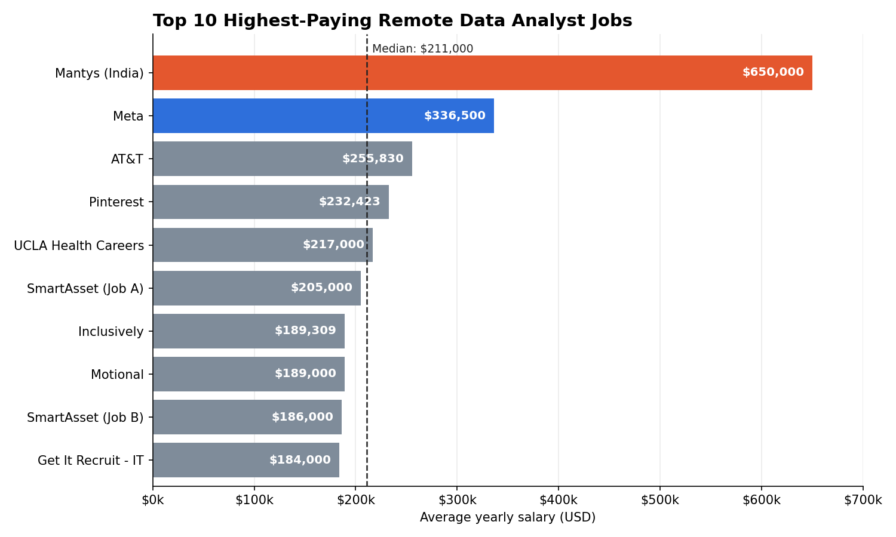
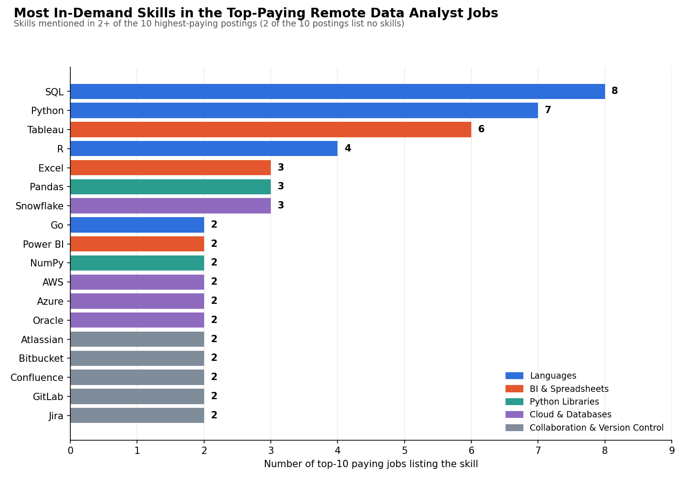
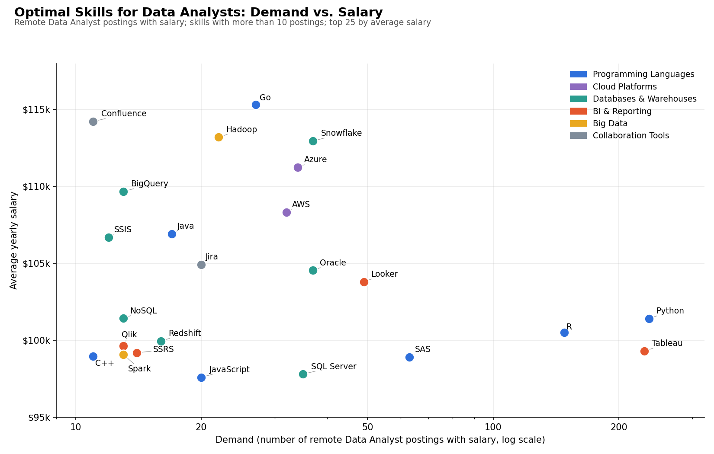

# 📊 Data Analyst Job Market Analysis (SQL)

A SQL project exploring the data analyst job market: which roles pay the most, which skills they ask for, and which skills are worth learning first.

# Introduction

Breaking into data analytics means deciding where to spend limited learning time. This project uses SQL to dig into a job postings dataset and answer five questions:

1. What are the top-paying remote Data Analyst jobs?
2. What skills do those top-paying jobs require?
3. What skills are most in demand for Data Analysts?
4. Which skills are associated with the highest salaries?
5. Which skills are the most *optimal* to learn (high demand **and** high pay)?

🔍 SQL queries: see the [project folder](./) — one file per question.

# Background

The goal was to navigate the analyst job market more effectively by replacing guesswork with data. Instead of learning every tool on the internet, the analysis pinpoints the highest-paid and most requested skills so that learning effort goes where it pays off.

The data comes from a job postings dataset made up of four related tables:

| Table | What it holds |
|---|---|
| `job_postings_fact` | job_id, company_id, job_title_short, job_title, job_location, job_via, job_schedule_type, job_work_from_home, search_location, job_posted_date, job_no_degree_mention, job_country, salary_rate, salary_year_avg, salary_hour_avg |
| `company_dim` | Company names, linked by `company_id` |
| `skills_dim` | Skill names, linked by `skill_id` |
| `skills_job_dim` | Bridge table connecting each job to its required skills |

# Tools I Used

- **SQL** – the core of the analysis (joins, CTEs, aggregations, filtering)
- **PostgreSQL** – database used to run the queries
- **Visual Studio Code** – editor for writing and running queries
- **Git & GitHub** – version control and sharing the project

# The Analysis

Each query targets one question. All of them focus on the **Data Analyst** role.

## 1. Top-Paying Data Analyst Jobs

**File:** `1_top_paying_job.sql`

I filtered Data Analyst postings with a listed yearly salary and a location of `Anywhere` (remote), joined the company name, and kept the 10 highest-paying roles.

```sql
SELECT
    job_id,
    job_title_short,
    salary_year_avg,
    job_posted_date,
    job_schedule_type,
    job_location,
    job_country,
    c.name AS company_name
FROM job_postings_fact
LEFT JOIN company_dim AS c ON job_postings_fact.company_id = c.company_id
WHERE
    job_title_short = 'Data Analyst'
    AND salary_year_avg IS NOT NULL
    AND job_location = 'Anywhere'
ORDER BY salary_year_avg DESC
LIMIT 10;
```
**Key Insights**
- **Huge salary spread:** the top 10 range from **$184,000 to $650,000**, with an average of about **$264,500** and a median of **$211,000**.
- **One clear outlier:** Mantys (India) pays $650,000, nearly double Meta's $336,500. Excluding it, the average drops to about **$221,700**, so treat it with caution.
- **Most salaries cluster tightly:** 6 of the 10 roles fall between **$184,000 and $217,000**, which is a more realistic target range.
- **US-heavy:** 9 of the 10 roles are US-based, even though all are advertised as remote.
- **All full-time:** every top-paying role is a full-time position, with no contract or part-time roles in the top 10.
- **Varied industries:** tech (Meta, Pinterest), telecom (AT&T), fintech (SmartAsset), healthcare (UCLA Health) and autonomous vehicles (Motional) all appear. SmartAsset shows up twice.


*Top paying remote Data Analyst jobs. The dashed line marks the median salary.*


## 2. Skills Required for Top-Paying Jobs

**File:** `2_top_paying_job_skills.sql`

I reused the top 10 jobs from Query 1 as a CTE and joined them to the skills tables to see what those employers ask for.

```sql
WITH top_paying_jobs AS (
    SELECT job_id, job_title_short, salary_year_avg, job_country, c.name AS company_name
    FROM job_postings_fact
    LEFT JOIN company_dim AS c ON job_postings_fact.company_id = c.company_id
    WHERE job_title_short = 'Data Analyst'
      AND salary_year_avg IS NOT NULL
      AND job_location = 'Anywhere'
    ORDER BY salary_year_avg DESC
    LIMIT 10
)
SELECT top_paying_jobs.*, skills
FROM top_paying_jobs
LEFT JOIN skills_job_dim ON top_paying_jobs.job_id = skills_job_dim.job_id
LEFT JOIN skills_dim ON skills_job_dim.skill_id = skills_dim.skill_id
ORDER BY salary_year_avg DESC;
```

| Skill | Appears in (of 10 jobs) |
|---|---|
| SQL | 8 |
| Python | 7 |
| Tableau | 6 |
| R | 4 |
| Excel, Pandas, Snowflake | 3 each |
| Azure, AWS, Oracle, Power BI, NumPy | 2 each |
| Bitbucket, GitLab, Atlassian, Jira, Confluence | 2 each |

**Key Insights**

- **The "Big Three" Dominate:** SQL is the most highly requested skill, appearing 
in 8 out of the 10 job listings. It is closely followed by Python (7 jobs) and Tableau (6 jobs).

- **Statistical & Data Manipulation Tools:** R is explicitly required in 4 of the roles. 
Pandas (a Python library) and Excel are each explicitly mentioned 3 times.

- **Cloud & Data Warehousing:** Snowflake (3 jobs) is the most prominent data warehousing platform
among these high-tier roles, beating out cloud platforms like Azure and AWS (2 jobs each), as well as Oracle (2 jobs).

- **Collaboration & Version Control:** High-paying roles heavily index on collaborative engineering 
environments, with Bitbucket, Gitlab, Atlassian, and Confluence each appearing twice. 



## 3. Most In-Demand Skills

**File:** `3_most_indemand_skills.sql`

Here I counted how often each skill appears across **all** Data Analyst postings (not just high-paying ones). The file contains two approaches: a direct `INNER JOIN` with `GROUP BY`, and a CTE version that counts skills first and then joins the names.

```sql
WITH remote_job_skills AS (
    SELECT skill_id, COUNT(*) AS skill_count
    FROM skills_job_dim
    INNER JOIN job_postings_fact ON skills_job_dim.job_id = job_postings_fact.job_id
    WHERE job_title_short = 'Data Analyst'
    GROUP BY skill_id
)
SELECT skills_dim.skill_id, skills_dim.skills AS skills, skill_count
FROM remote_job_skills
INNER JOIN skills_dim ON remote_job_skills.skill_id = skills_dim.skill_id
ORDER BY skill_count DESC
LIMIT 10;
```

| Rank | Skill | Demand Count |
|:----:|:------|-------------:|
| 1 | SQL | 92,628 |
| 2 | Excel | 67,031 |
| 3 | Python | 57,326 |
| 4 | Tableau | 46,554 |
| 5 | Power BI | 39,468 |
| 6 | R | 30,075 |
| 7 | SAS | 14,034 |
| 8 | PowerPoint | 13,848 |
| 9 | Word | 13,591 |

*Demand count = number of Data Analyst job postings listing the skill.*

**Key Insights**
- **SQL is the most requested skill** with 92,628 postings, about 1.6x Python's demand.
- **Excel ranks second (67,031),** ahead of Python, so spreadsheet skills are still a core requirement.
- **Python is third (57,326),** and R is sixth (30,075). Programming skills matter, but they trail SQL and Excel.
- **Visualization tools are in the top 5:** Tableau (46,554) and Power BI (39,468) show that dashboarding and reporting are central to the role.
- **A sharp drop after R:** demand halves from R (30,075) to SAS (14,034), so the first six skills clearly form the core toolkit.
- **Communication tools count too:** PowerPoint and Word both appear in over 13,000 postings, reflecting how much of the job is presenting findings.

## 4. Skills Based on Salary

**File:** `4_top_paying_skills.sql`

For every skill, I calculated the average yearly salary of remote Data Analyst postings that mention it, then ranked the top 25.

```sql
SELECT
    skills,
    ROUND(AVG(salary_year_avg), 0) AS avg_salary
FROM job_postings_fact
INNER JOIN skills_job_dim ON job_postings_fact.job_id = skills_job_dim.job_id
INNER JOIN skills_dim ON skills_job_dim.skill_id = skills_dim.skill_id
WHERE job_title_short = 'Data Analyst'
  AND salary_year_avg IS NOT NULL
  AND job_work_from_home IS TRUE
GROUP BY skills
ORDER BY avg_salary DESC
LIMIT 25;
```
| Rank | Skill | Avg. Yearly Salary |
|:----:|:------|-------------------:|
| 1 | PySpark | $208,172 |
| 2 | Bitbucket | $189,155 |
| 3 | Couchbase | $160,515 |
| 4 | Watson | $160,515 |
| 5 | DataRobot | $155,486 |
| 6 | GitLab | $154,500 |
| 7 | Swift | $153,750 |
| 8 | Jupyter | $152,777 |
| 9 | Pandas | $151,821 |
| 10 | Elasticsearch | $145,000 |
| 11 | Golang | $145,000 |
| 12 | NumPy | $143,513 |
| 13 | Databricks | $141,907 |
| 14 | Linux | $136,508 |
| 15 | Kubernetes | $132,500 |
| 16 | Atlassian | $131,162 |
| 17 | Twilio | $127,000 |
| 18 | Airflow | $126,103 |
| 19 | Scikit-learn | $125,781 |
| 20 | Jenkins | $125,436 |
| 21 | Notion | $125,000 |
| 22 | Scala | $124,903 |
| 23 | PostgreSQL | $123,879 |
| 24 | GCP | $122,500 |
| 25 | MicroStrategy | $121,619 |

*Average yearly salary of remote Data Analyst postings that list each skill.*

**Key Insights**
- **Big data leads pay:** PySpark tops the list at **$208,172**, well ahead of everything else, so distributed data processing carries the biggest salary premium.
- **DevOps and engineering tools are lucrative:** Bitbucket ($189,155), GitLab ($154,500), Kubernetes, Linux, Jenkins and Airflow all appear, so analysts who work in software engineering environments get paid more.
- **Enterprise AI beats open-source ML:** Watson ($160,515) and DataRobot ($155,486) pay more than Scikit-learn ($125,781).
- **The Python stack anchors pay:** Jupyter, Pandas and NumPy sit between roughly **$143k and $153k**.
- **Modern data engineering tools pay well:** Databricks ($141,907), Airflow ($126,103) and Scala ($124,903) all make the top 25.
- **NoSQL and specialised databases beat relational ones:** Couchbase ($160,515) and Elasticsearch ($145,000) out-earn PostgreSQL ($123,879).
- **A narrow band after the top two:** ranks 3 to 25 fall between about **$122k and $161k**, so PySpark and Bitbucket are the clear outliers.


## 5. Most Optimal Skills to Learn

**File:** `5_optimal_skill.sql`

Query 4 alone can mislead, because a skill found in only one or two postings can have a very high average. To fix this, I combined **demand** and **salary** in one query and required a skill to appear in more than 10 postings (`HAVING COUNT(...) > 10`). The file has a two-CTE version and a more concise single-query version.

```sql
SELECT
    skills.skill_id,
    skills.skills,
    COUNT(skills_job.job_id) AS demand_count,
    ROUND(AVG(jobs.salary_year_avg), 0) AS average_salary
FROM job_postings_fact AS jobs
INNER JOIN skills_job_dim AS skills_job ON jobs.job_id = skills_job.job_id
INNER JOIN skills_dim AS skills ON skills_job.skill_id = skills.skill_id
WHERE job_title_short = 'Data Analyst'
  AND salary_year_avg IS NOT NULL
  AND job_work_from_home = TRUE
GROUP BY skills.skill_id
HAVING COUNT(skills_job.job_id) > 10
ORDER BY average_salary DESC, demand_count DESC
LIMIT 25;
```

| Rank | Skill | Demand Count | Avg. Yearly Salary |
|:----:|:------|-------------:|-------------------:|
| 1 | Go | 27 | $115,320 |
| 2 | Confluence | 11 | $114,210 |
| 3 | Hadoop | 22 | $113,193 |
| 4 | Snowflake | 37 | $112,948 |
| 5 | Azure | 34 | $111,225 |
| 6 | BigQuery | 13 | $109,654 |
| 7 | AWS | 32 | $108,317 |
| 8 | Java | 17 | $106,906 |
| 9 | SSIS | 12 | $106,683 |
| 10 | Jira | 20 | $104,918 |
| 11 | Oracle | 37 | $104,534 |
| 12 | Looker | 49 | $103,795 |
| 13 | NoSQL | 13 | $101,414 |
| 14 | Python | 236 | $101,397 |
| 15 | R | 148 | $100,499 |
| 16 | Redshift | 16 | $99,936 |
| 17 | Qlik | 13 | $99,631 |
| 18 | Tableau | 230 | $99,288 |
| 19 | SSRS | 14 | $99,171 |
| 20 | Spark | 13 | $99,077 |
| 21 | C++ | 11 | $98,958 |
| 22 | SAS | 63 | $98,902 |
| 23 | SQL Server | 35 | $97,786 |
| 24 | JavaScript | 20 | $97,587 |

**Key Insights**
- **Python and Tableau dominate demand:** Python (236 postings) and Tableau (230) are far ahead of everything else, while still paying about **$99k to $101k**. R follows with 148 postings at $100,499.
- **Cloud and data warehouse skills pay the most for their demand:** Snowflake ($112,948, 37 postings), Azure ($111,225, 34) and AWS ($108,317, 32) combine solid demand with pay well above the Python/Tableau level.
- **Go has the highest average salary ($115,320)** with 27 postings, and Hadoop ($113,193, 22 postings) also pays well, so engineering-leaning skills carry a premium.
- **Looker beats other BI tools:** it pays $103,795 with 49 postings, ahead of Qlik ($99,631) and Tableau ($99,288).
- **Salaries are realistic once demand is filtered:** with more than 10 postings required, the top pay falls to **$115k**, compared with **$208k** for PySpark in Query 4. Small samples inflated those earlier averages.
- **A narrow band:** all 24 skills sit between **$97.6k and $115.3k**, so skill choice shifts pay by about $18k, not by multiples.
- **SQL and Excel are missing from the top 25 by salary.** They are the most requested skills (Query 3), but their averages are below $97.6k, so they are the foundation rather than the salary boosters.


*Remote Data Analyst postings with a listed salary. Only skills with more than 10 postings are included.*
# What I Learned

- **Joins and bridge tables:** Connecting jobs to skills through `skills_job_dim` made many-to-many relationships click. I practised `INNER JOIN` vs `LEFT JOIN` and saw the difference first-hand: the `LEFT JOIN` kept jobs with no listed skills.
- **CTEs make queries readable:** Reusing the top-10 jobs from Query 1 inside Query 2, and splitting demand and salary in Query 5, was far cleaner than nested subqueries.
- **Aggregation and `HAVING`:** `GROUP BY` with `COUNT` and `AVG` answered most questions, and `HAVING` was the right tool for filtering on aggregated results.
- **Averages can lie:** Skills with few postings inflate averages, which is why Query 5 adds a minimum demand threshold. Two skills sharing the same average (Watson and Couchbase, $160,515) hints at a very small sample behind them.
- **Definitions matter:** "Remote" was defined as `job_location = 'Anywhere'` in Queries 1–2 and as `job_work_from_home = TRUE` in Queries 4–5. Being consistent, or at least explicit, avoids apples-to-oranges comparisons.
- **Clean, documented queries:** Writing the question, filters and reasoning as comments at the top of each file made the project much easier to revisit.

# Conclusions

**Insights**

1. **Remote Data Analyst jobs can pay very well:** the top 10 range from $184,000 to $650,000, though the highest figure is an outlier.
2. **SQL is non-negotiable:** it appeared in every top-paying posting that lists skills, followed by Python and Tableau.
3. **Specialised skills earn a premium:** PySpark, version control tools (Bitbucket, GitLab) and enterprise AI platforms sit at the top of the salary ranking.
4. **Cloud and warehousing add value:** Snowflake, Azure and AWS recur in high-paying roles.
5. **Balance demand and pay:** the best skills to learn are those that are both frequently requested and well paid, which is what Query 5 measures.

**Suggested learning path**
Build a strong base in **SQL, Python (Pandas/NumPy) and Tableau**, then layer on **a cloud data warehouse (e.g. Snowflake)** and **big data tools (PySpark)** to move toward the highest-paying roles.

**Limitations**
- Salary data is only available for a subset of postings, so results may not reflect the whole market.
- Some top-paying postings list no skills, and skill averages depend on small samples for niche tools.
- The dataset is a snapshot in time; demand and pay shift as the market changes.

---

⭐ If you found this project useful, feel free to star the repo!